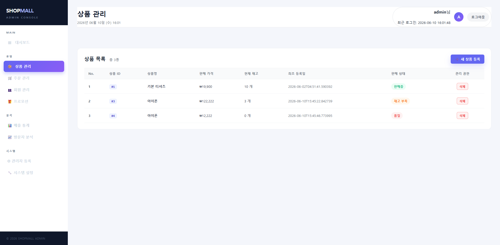
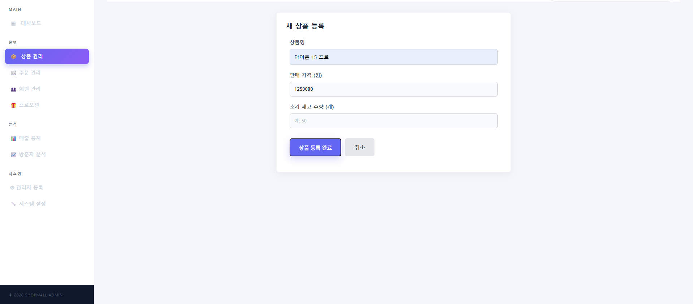
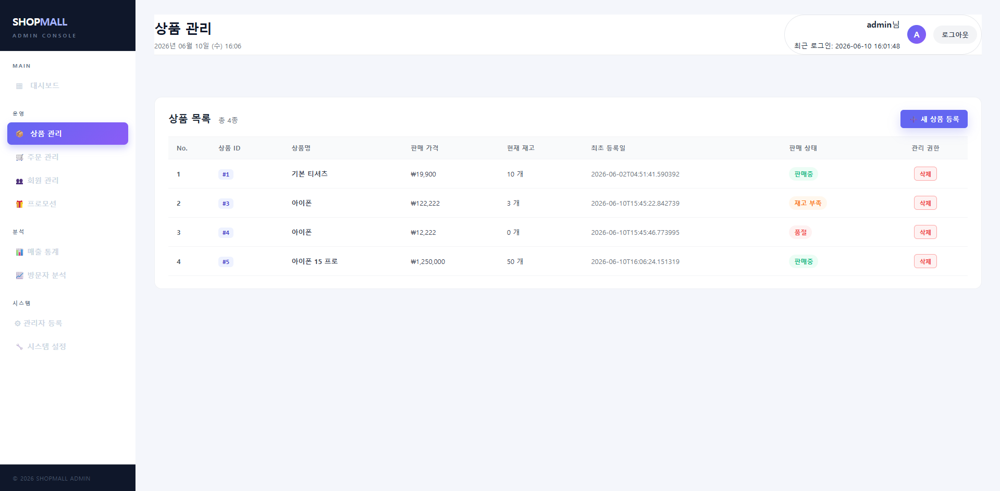
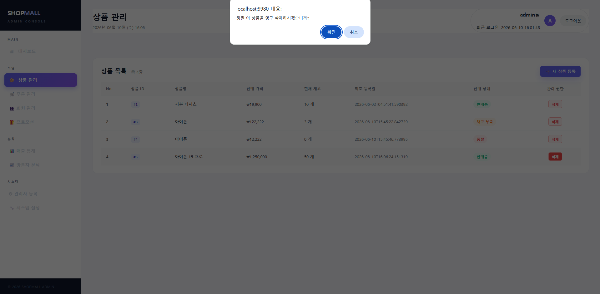
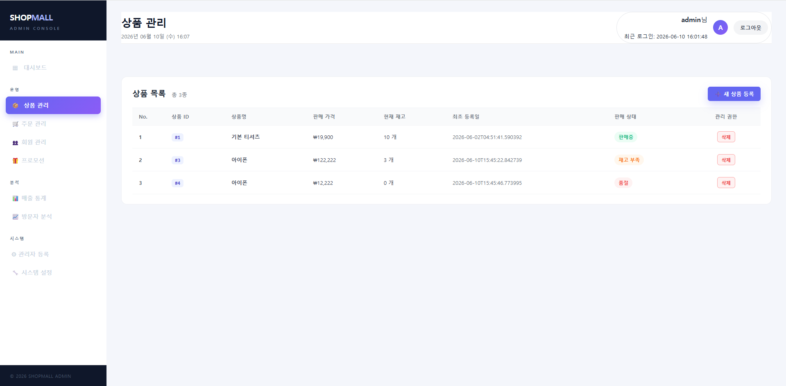

# 2026년도 1학기 - 웹서버프로그래밍

# 🛒 쇼핑몰 백오피스 시스템 - 상품 관리 기능 구현 계획서

본 프로젝트는 쇼핑몰 관리자가 효율적으로 상품을 관리할 수 있도록 지원하는 통합 대시보드 시스템입니다.  
로그인 후 진입하는 대시보드 뼈대(좌측 고정 사이드바 및 상단 관리자 프로필 바) 레이아웃을 일관되게 유지하며 화면을 전환하는 **템플릿 기반 방식**으로 개발되었습니다.

---

## 📌 1. 핵심 기능 및 서비스 흐름

### 📦 [기능 1] 상품 목록 조회 및 상태 관리
* **설명:** DB에 등록된 모든 상품의 정보를 가독성 높은 그리드 테이블 형태로 출력합니다.
* **UX/UI 개선:** 데이터베이스 고유 ID(`#ID`)와 별개로 관리자가 현재 등록된 총 상품 개수를 직관적으로 파악할 수 있도록 **화면 표시용 연번(No.)** 컬럼을 적용했습니다.
* **상태값 분기 처리 (3가지 형식):**
  * `판매중`: 재고가 6개 이상인 정상 판매 상품
  * `재고 부족`: 품절 임박 상품 (재고 1개 ~ 5개 이하) ⚠️ 관리자 경고
  * `품절`: 재고가 0개인 상품 🛑 판매 중지 상태

*▲ 최초 상품 목록 화면 (판매중, 재고 부족, 품절 3개의 상품이 등록된 상태)*

---

### ✨ [기능 2] 새 상품 등록 및 화면 연결
* **설명:** 상품 관리 홈 우측 상단의 `➕ 새 상품 등록` 버튼을 클릭하면 등록 전용 폼 화면으로 이동합니다.
* **입력 검증:** 상품명, 판매 가격, 초기 재고 수량을 입력받으며 필수 항목 입력 검증(`required`)이 작동합니다.

*▲ 새 상품 등록 폼 입력 화면*

* **등록 완료 후 데이터 연결:**
  * 등록 완료 버튼을 누르면 내부 서블릿/JSP(`registerSubmit.jsp`)를 거쳐 DB 안전 저장이 수행됩니다.
  * 처리 완료 후 다시 목록 화면으로 리다이렉트되어, 기존 3개 상품에 방금 추가한 신규 상품이 더해져 **총 4개의 상품**이 정상 출력됩니다.
  * 새로 추가된 상품은 초기 재고가 `판매중` 상태로 매칭됩니다.

*▲ 상품 등록 완료 후 4개의 상품과 '판매중' 상태가 반영된 연동 화면*

---

### 🗑️ [기능 3] 안전한 상품 영구 삭제
* **설명:** 무분별한 데이터 유실을 방지하기 위해 [삭제] 버튼 클릭 시 브라우저 기본 컨펌창(`confirm`)을 활용한 2차 검증을 수행합니다.
* **데이터 무결성:** 관리자가 확인을 누를 시에만 `deleteSubmit.jsp`로 상품 고유 ID 파라미터를 전송하여 안전하게 삭제 처리를 마무리합니다.

*▲ 삭제 클릭 시 발생하는 "정말 이 상품을 영구 삭제하시겠습니까?" 안내 문구 이미지*

* **삭제 완료 후 화면 연동:**
  * 삭제 처리가 완료되면 다시 상품 목록 페이지로 리다이렉트됩니다.
  * DB에서 해당 데이터가 영구 삭제되어 목록에서 완전히 사라진 것을 확인할 수 있습니다.
  * 화면단(UI Layer) 루프 연산 덕분에 특정 행이 삭제되어도 연번(No.)이 깨지거나 공백이 생기지 않고, **순서대로 재정렬된 깔끔한 리스트**가 출력됩니다.

*▲ 상품 삭제 완료 후 리스트가 실시간으로 갱신되어 반영된 최종 화면*

---

## 💻 2. 기술 스택 및 개발 아키텍처

* **Language/Environment:** Java 17, Jakarta EE (JSP/Servlet), Apache Tomcat 10.1
* **Database:** H2 Database (File Mode)
* **Architecture:** Pattern-driven (DTO - Repository - Service - JSP UI Layer)
* **Design Pattern:** * 계층 간 독립성을 보장하기 위해 데이터베이스 계층은 `ProductRepository.delete()`, 비즈니스 서비스 계층은 `ProductService.removeProduct()`로 명칭을 분리 분기하여 유지보수성을 극대화했습니다.
  * 내부 고유 키값 무결성 유지를 위해 DB의 `AUTO_INCREMENT` 기능을 활용하므로 중간 데이터 삭제 시 ID 공백이 발생하지만, UI Layer에서 변수 루프 연번 연산을 처리하여 관리자에게는 늘 번호가 밀리지 않는 깔끔한 일련번호를 보장합니다.
